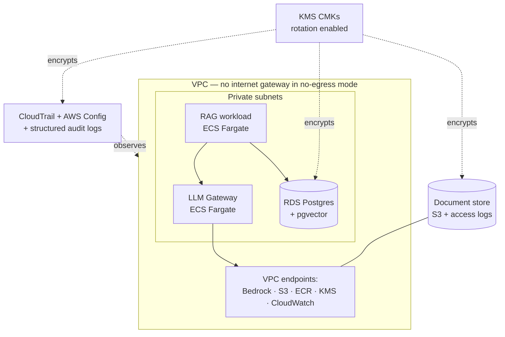

# Federal LLM Blueprint

Terraform reference architecture for running LLM workloads in federal environments — no-egress networking, KMS encryption everywhere, structured audit logging, and an explicit NIST 800-53 rev5 control mapping. Deployable in commercial AWS; designed for AWS GovCloud.

**Status: private build phase — target public launch v0.1.0 on August 30, 2026.**

## Why This Exists

Reference architectures for LLM systems assume open internet and SaaS observability. Federal deployments assume the opposite: private connectivity, customer-managed keys, auditable everything, and an ATO process that wants to know which control every design decision satisfies. Nobody publishes that reference. This is it.

## Planned Architecture

- **Modules:** network, kms, iam, ecs-llm-gateway, vector-store, document-store, audit, observability
- **Modes:** `no_egress = true` (VPC-endpoint-only, the GovCloud/air-gap posture) or standard private
- **Compliance:** `CONTROLS.md` maps every module to NIST 800-53 rev5 controls (AC, AU, CM, IA, RA, SC, SI); threat model included
- **Proof:** the full-stack example deploys [agentic-rag](https://github.com/uehlingeric/agentic-rag) as the workload

## Build Roadmap

| Week | Dates (2026) | Theme | Plan |
|------|--------------|-------|------|
| 1 | Jul 6 – Jul 12 | Foundations: standards, skeleton, CI, architecture doc | [week-01](docs/plan/week-01.md) |
| 2 | Jul 13 – Jul 19 | Network module: VPC, endpoints, no-egress mode | [week-02](docs/plan/week-02.md) |
| 3 | Jul 20 – Jul 26 | Security core: KMS, IAM/RBAC, secrets | [week-03](docs/plan/week-03.md) |
| 4 | Jul 27 – Aug 2 | Compute: ECS Fargate LLM gateway | [week-04](docs/plan/week-04.md) |
| 5 | Aug 3 – Aug 9 | Data layer: pgvector store + document store | [week-05](docs/plan/week-05.md) |
| 6 | Aug 10 – Aug 16 | Audit & observability: CloudTrail, Config, alarms | [week-06](docs/plan/week-06.md) |
| 7 | Aug 17 – Aug 23 | Compliance docs: CONTROLS.md, threat model, air-gap guide | [week-07](docs/plan/week-07.md) |
| 8 | Aug 24 – Aug 30 | Launch: full-stack example, cost doc, v0.1.0 public | [week-08](docs/plan/week-08.md) |

## Launch Success Criteria

- [ ] `terraform apply` on the full-stack example deploys a working, cited-answer RAG stack in a no-egress VPC
- [ ] CONTROLS.md maps all modules to specific 800-53 rev5 controls with implementation notes
- [ ] CI green: fmt + validate + tflint + checkov (zero high/critical findings) + terraform-docs current
- [ ] Threat model and air-gap deployment guide published
- [ ] Documented monthly cost estimate for minimal and full-stack examples

## License

MIT — see [LICENSE](LICENSE).
