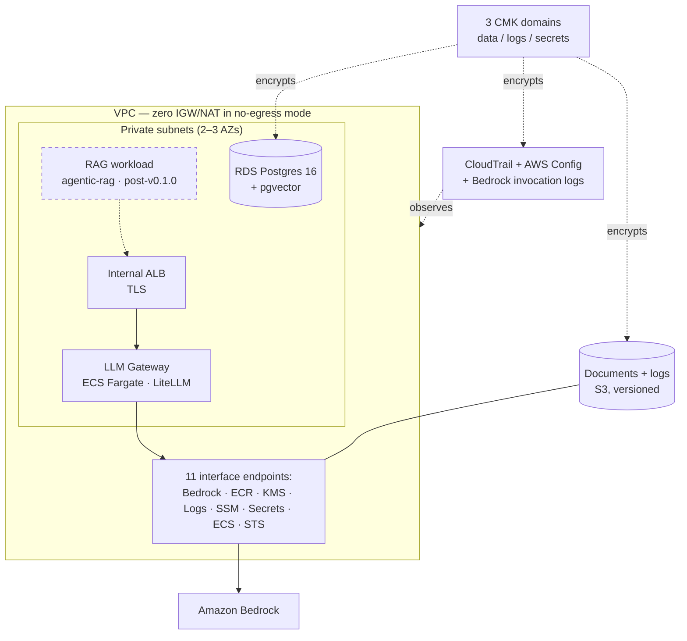

# Federal LLM Blueprint

Terraform reference architecture for LLM workloads in federal environments — a no-egress VPC, customer-managed KMS everywhere, five audited operational planes, and an explicit [NIST 800-53 rev5 control mapping](CONTROLS.md). Deployable in commercial AWS; designed for AWS GovCloud.

[](https://github.com/uehlingeric/federal-llm-blueprint/actions/workflows/ci.yml)
[](LICENSE)
[](https://developer.hashicorp.com/terraform)
[](https://registry.terraform.io/providers/hashicorp/aws/latest)
[](CONTROLS.md)



## Control Coverage

[CONTROLS.md](CONTROLS.md) maps 24 NIST 800-53 rev5 controls with implementation statements and resource-level citations, mirrored machine-readably in [docs/controls.yaml](docs/controls.yaml) and generated as an [OSCAL component definition](docs/oscal/component-definition.json) for SSP tooling. CI enforces that all three stay in sync.

| Family | Controls | Implemented across |
|---|---|---|
| AC — Access Control | 4 | iam, network, ecs-llm-gateway, vector-store, document-store, audit |
| AU — Audit & Accountability | 6 | audit, observability, vector-store |
| CM — Configuration Management | 3 | CI gates, audit (Config rules) |
| IA — Identification & Authentication | 2 | iam, kms, vector-store |
| RA — Risk Assessment | 1 | CI security scanning (checkov) |
| SC — System & Communications Protection | 7 | network, kms, iam, ecs-llm-gateway, vector-store, document-store, audit, observability |
| SI — System & Information Integrity | 1 | observability, audit, network, ecs-llm-gateway |

## What This Is (and Isn't)

**It is** a reference architecture: eight production-shaped Terraform modules, two runnable compositions, a [STRIDE threat model](docs/threat-model.md), an [air-gap/GovCloud guide](docs/airgap-guide.md), and executable [verification procedures](docs/verification/). Control language is deliberate — the stack *is aligned to* controls and *implements* or *contributes to* them; detective controls *flag*, never prevent.

**It is not** an ATO package. No reference architecture makes you compliant; your SSP, your assessor, and your deployment's specifics do. The [threat model](docs/threat-model.md) and CONTROLS.md responsibility columns say exactly what is inherited from AWS, what the stack implements, and what remains yours.

## Quickstart

Prerequisites: Terraform ≥ 1.9, AWS credentials for a sandbox account, the target Bedrock model enabled (console → Model access), and the LiteLLM image mirrored into private ECR (no-egress VPCs cannot reach public registries — [procedure](examples/minimal/README.md#container-image-mirror-to-ecr-then-pin)).

```bash
cd examples/minimal
cp terraform.tfvars.example terraform.tfvars   # set your mirrored image digest
terraform init && terraform apply
# populate the gateway master key, then prove it end to end:
# docs/verification/gateway-proof.md
```

| Composition | Profile | Measured cost |
|---|---|---|
| [examples/minimal](examples/minimal/) | 2 AZs, single-AZ RDS, 90-day retention | [docs/costs.md](docs/costs.md) |
| [examples/full-stack](examples/full-stack/) | 3 AZs, multi-AZ RDS, 365-day retention, HA gateway, all toggles surfaced | [docs/costs.md](docs/costs.md) |

## Modules

| Module | What it owns |
|---|---|
| [network](modules/network/) | No-egress VPC, 11 interface endpoints + S3 gateway, flow logs, app/endpoint SGs |
| [kms](modules/kms/) | Three CMK domains (data/logs/secrets), rotation, least-privilege key policies |
| [iam](modules/iam/) | Permission boundary, task roles, optional CI role and MFA-gated human tiers |
| [ecs-llm-gateway](modules/ecs-llm-gateway/) | Fargate LiteLLM service, hardened tasks, internal TLS ALB, autoscaling, alarms |
| [vector-store](modules/vector-store/) | RDS Postgres 16 + pgvector, IAM DB auth, RDS-managed secret, multi-AZ |
| [document-store](modules/document-store/) | Documents/access-logs/ALB-logs buckets, SSE-KMS, optional object lock |
| [audit](modules/audit/) | CloudTrail (multi-region, data events), AWS Config + annotated rules, Bedrock invocation logging |
| [observability](modules/observability/) | Alarm baseline, log-group factory, Config-noncompliance events, dashboard, SNS |

Every module: native `terraform test` suite (121 runs total), checkov-clean with inline-justified skips only, terraform-docs-current README, tested against the Terraform 1.9.8 floor.

## Documentation

- [Architecture](docs/architecture.md) — five planes, interface contracts, no-egress invariants, data flows
- [Threat model](docs/threat-model.md) — STRIDE across the five planes, LLM-specific threats
- [Air-gap / GovCloud guide](docs/airgap-guide.md) — partition differences, availability caveats, true-air-gap posture
- [Audit correlation](docs/audit-correlation.md) — tracing a request across gateway, Bedrock, and CloudTrail planes
- [Costs](docs/costs.md) — measured run-rates, the four expensive toggles, cheap-mode alternatives
- [ADRs](docs/adr/) — seven decision records, Fargate-over-EKS through prompt-capture posture
- [Verification](docs/verification/) — executable proofs: no-egress, gateway, vector store, audit walkthrough, full stack

## The Companion Workload

This repo is one half of a pair:

- **`agentic-rag`** — the workload this infrastructure is designed to run: provider-agnostic agentic RAG with hybrid retrieval, guardrails, and published evals. It publishes separately; its container integration into `examples/full-stack` lands post-v0.1.0.
- **federal-llm-blueprint** (this repo) — the infrastructure that runs it: the no-egress network, the audited data planes, and the control mapping the workload inherits.

## Build History

Built in eight planned weeks, one plane at a time — plans in [docs/plan/](docs/plan/): foundations & CI, network, security core, compute, data, audit & observability, compliance docs, launch. The [CHANGELOG](CHANGELOG.md) records what shipped.

## License

MIT — see [LICENSE](LICENSE).
