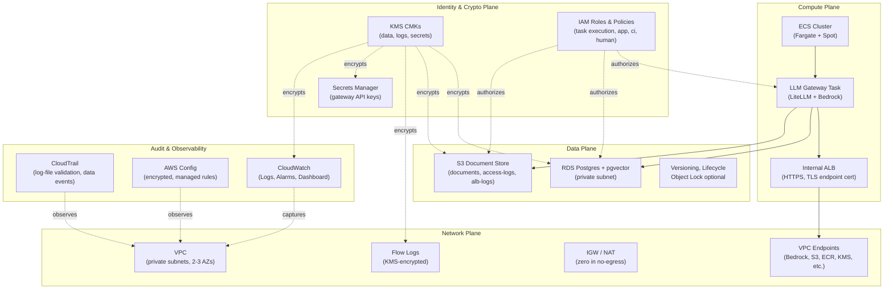
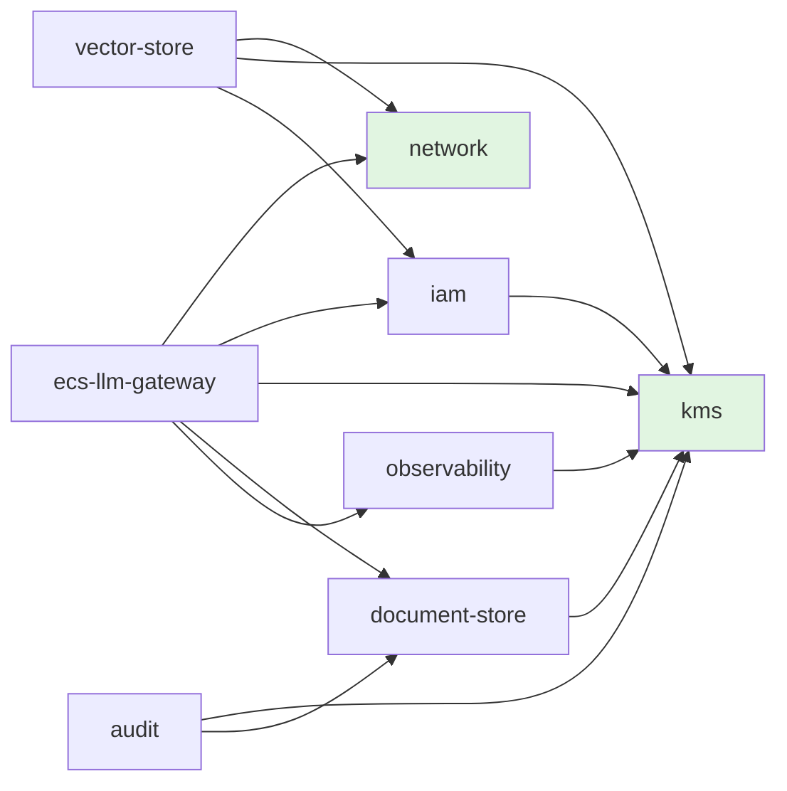
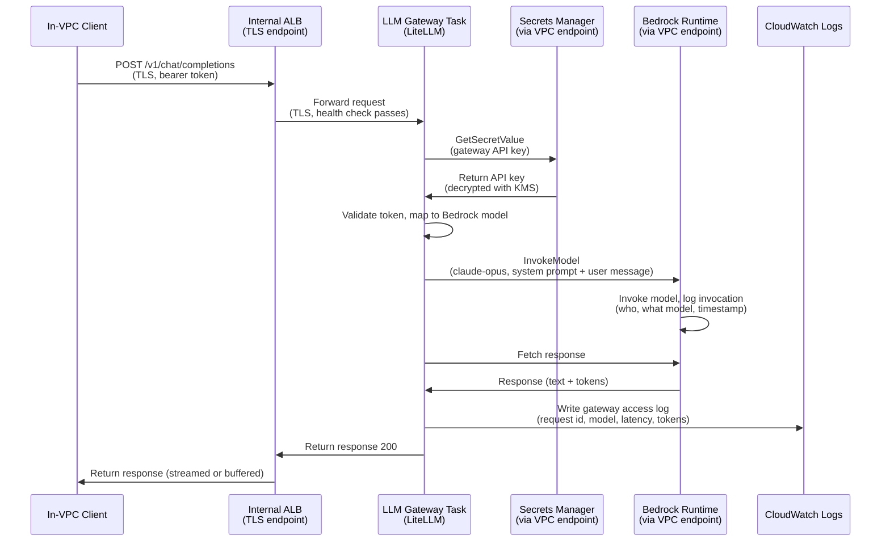
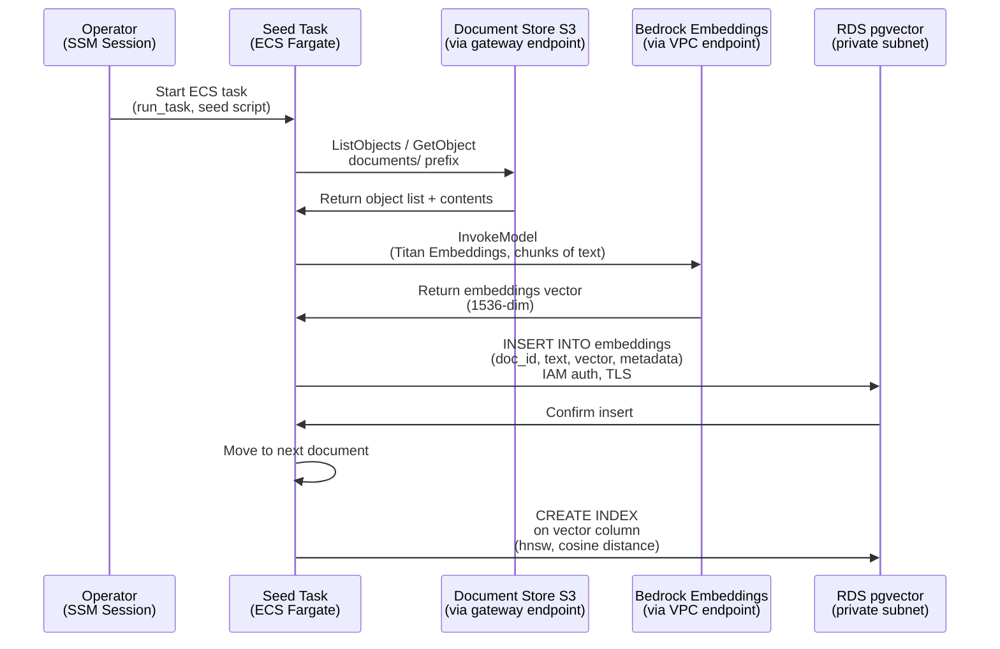
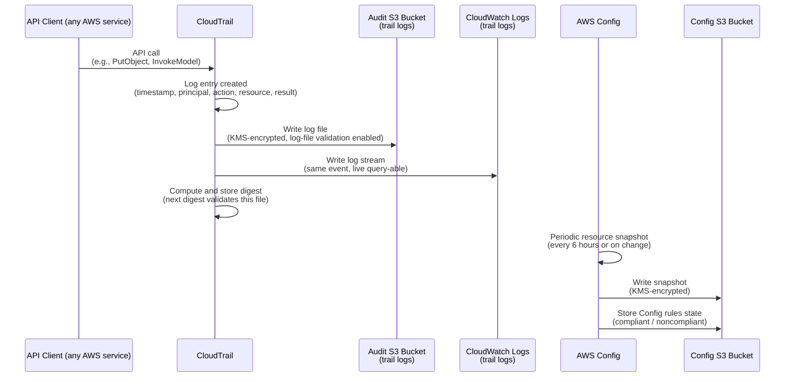

# Architecture — Federal LLM Blueprint

## 1. Overview

This reference architecture deploys private-VPC LLM inference and RAG workloads on AWS with federal compliance posture: no public internet connectivity (in `no_egress` mode), customer-managed KMS encryption everywhere, structured audit logging, and an explicit NIST 800-53 rev5 control mapping. The system consists of eight Terraform modules that compose into two deployment modes:

- **Standard-private mode:** Private VPC, internal load balancer, optional NAT for non-federal use cases.
- **No-egress mode:** Zero internet gateways, zero NAT gateways, all AWS service traffic via private VPC endpoints (the GovCloud-ready configuration).

This document defines each module's responsibility, the interfaces between them (output contracts that downstream modules depend on), and the precise semantics of no-egress mode: what is reachable from inside the VPC and what is provably not. The next seven build weeks implement against these contracts.

---

## 2. Planes

The system organizes into five logical planes, each with distinct responsibilities:

### Network Plane
The foundation: VPC with private-subnet-only architecture across 2–3 availability zones. In standard-private mode, optional public subnets and NAT gateways enable corporate network integration. In no-egress mode, zero internet gateways and zero NAT gateways; all AWS service traffic routes through dedicated VPC endpoints with private DNS resolution enabled. Flow logs are mandatory, KMS-encrypted, and retained per compliance requirements (default 90 days).

### Identity & Crypto Plane
Customer-managed KMS CMKs (separate keys for data, logs, and secrets) with automatic rotation. IAM roles follow least-privilege patterns with permission boundaries applied to all created roles. Secrets Manager stores gateway API keys with KMS encryption; rotation lambda patterns documented for federal deployment.

### Compute Plane
ECS Fargate cluster running the LLM gateway (LiteLLM reference implementation). An internal Application Load Balancer (private subnets only) terminates TLS using either a private CA certificate (ACM PCA, for no-egress production) or self-signed (sandbox-only). The gateway proxies completion requests to Bedrock via the network plane's Bedrock VPC endpoint.

### Data Plane
RDS Postgres with pgvector extension (IAM authentication, encrypted, no public accessibility). S3 document store with versioning, SSE-KMS encryption, access logging, and optional object lock for compliance-mode retention. Automated RDS backups and cross-region snapshot copies (optional, for disaster recovery planning).

### Audit & Observability Plane
CloudTrail with log-file validation, multi-region recording, and S3 + CloudWatch Logs destinations (all KMS-encrypted). AWS Config recorder with managed rule set encoding the repository's own claims (encrypted volumes, no public S3, IAM boundary presence, etc.). CloudWatch log groups and alarms provide real-time alerting on gateway health, ECS task restarts, database vitals, endpoint connectivity, and Config noncompliance events.

---

## 3. Module Responsibilities

| Module | Responsibility | Build Week |
|--------|-----------------|------------|
| **network** | VPC, private subnets (2–3 AZs), conditional IGW/NAT, all required VPC endpoints (Bedrock, S3, ECR, KMS, CloudWatch, Secrets Manager, ECS, STS), security groups for app and endpoints, flow logs. | 2 |
| **kms** | Customer-managed CMK set (data, logs, secrets domains), automatic rotation, least-privilege key policies, key grants for service integration, aliases. | 3 |
| **iam** | Task execution role (image pull, logs write), app task role (database, S3, Bedrock scoped), CI deployment role, human role tiers (admin, auditor, developer), permission boundaries. | 3 |
| **ecs-llm-gateway** | ECS Fargate cluster, hardened task definition (non-root, read-only FS, no privileged), LiteLLM container image (digest-pinned), internal ALB with TLS, health checks, autoscaling (CPU + request count). | 4 |
| **vector-store** | RDS Postgres 16 with pgvector, encrypted storage, IAM authentication, Secrets Manager rotation, private subnet only, database security group rules. | 5 |
| **document-store** | S3 bucket set (documents, access-logs, alb-logs), versioning, SSE-KMS, public-access block, TLS-only bucket policy, lifecycle policies, optional object lock. | 5 |
| **audit** | CloudTrail (multi-region, log-file validation, S3 + CloudWatch), AWS Config recorder, data event recording on document store, Config managed rules annotated to 800-53 controls. | 6 |
| **observability** | Log-group factory (KMS mandatory, retention mandatory), alarm baseline (gateway 5xx/latency, ECS restarts, RDS vitals, endpoint health, Config drift), SNS topic, CloudWatch dashboard. | 6 |

---

## 4. Module Dependency Graph

**Root modules** (no dependencies): `network`, `kms`  
**Mid-layer** (depend on roots): `iam`, `vector-store`, `document-store`  
**Compute layer**: `ecs-llm-gateway` (depends on network, iam, kms, document-store for ALB access logs, observability for alarm topic)  
**Audit layer**: `audit` (depends on kms, document-store for audit log bucket)  
**Observability layer**: `observability` (depends on kms for log-group encryption)  

The `examples/` directories compose all modules together; there are no circular dependencies.

---

## 5. Interface Contracts

These output names are binding contracts: downstream modules consume them by name. Implementing weeks must produce these outputs exactly as specified.

### network module outputs

| Output Name | Type | Description | Consumed By |
|-------------|------|-------------|------------|
| `vpc_id` | string | VPC resource ID | ecs-llm-gateway, vector-store |
| `vpc_cidr_block` | string | VPC CIDR (e.g., 10.0.0.0/16) | audit, observability (for flow-log rules) |
| `private_subnet_ids` | list(string) | Private subnet IDs across all AZs | ecs-llm-gateway, vector-store, document-store |
| `public_subnet_ids` | list(string) | Public subnet IDs (empty in no-egress mode) | ecs-llm-gateway (ALB placement, standard-private only) |
| `private_route_table_ids` | list(string) | Route table IDs for private subnets | audit (for Config rules, optional) |
| `app_security_group_id` | string | SG for ECS tasks and application workloads | ecs-llm-gateway (task SG), vector-store (ingress rule) |
| `endpoint_security_group_id` | string | SG for VPC endpoints (allows 443 from VPC CIDR) | (internal to network) |
| `interface_endpoint_ids` | map(string) | Endpoint IDs keyed by service (bedrock-runtime, bedrock-agent-runtime, ecr-api, ecr-dkr, logs, kms, secretsmanager, ecs, ecs-telemetry, sts) | observability (for endpoint-health alarms) |
| `gateway_endpoint_ids` | map(string) | S3 and optional DynamoDB gateway endpoint IDs | (internal to network) |
| `flow_log_group_name` | string | CloudWatch log group name for VPC flow logs | (internal, used by CloudWatch) |

### kms module outputs

| Output Name | Type | Description | Consumed By |
|-------------|------|-------------|------------|
| `key_arns` | map(string) | CMK ARNs keyed by domain (data, logs, secrets) | All modules that encrypt (ecs-llm-gateway, vector-store, document-store, audit, observability) |
| `key_ids` | map(string) | CMK IDs keyed by domain | iam (for key policy grants), all encrypting modules |
| `alias_arns` | map(string) | CMK alias ARNs keyed by domain | observability (for key-rotation alarms) |

### iam module outputs

| Output Name | Type | Description | Consumed By |
|-------------|------|-------------|------------|
| `task_execution_role_arn` | string | ECS task execution role (ECR pull, CloudWatch logs) | ecs-llm-gateway |
| `app_task_role_arn` | string | ECS app task role (scoped to named Bedrock models, specific S3 prefixes, specific database ARNs) | ecs-llm-gateway |
| `ci_deploy_role_arn` | string | CI role for `terraform plan/apply` from GitHub Actions | examples (referenced in GitHub Actions config) |
| `human_role_arns` | map(string) | Assumable human role ARNs keyed by tier (platform-admin, auditor, developer) | (external, for human access) |
| `permission_boundary_arn` | string | Permission boundary policy ARN (all created roles must have this attached) | (internal reference for policy validation) |

### ecs-llm-gateway module outputs

| Output Name | Type | Description |
|-------------|------|-------------|
| `alb_dns_name` | string | Internal ALB DNS name (for in-VPC client requests) |
| `alb_arn` | string | ALB ARN |
| `alb_security_group_id` | string | Security group ID for the ALB |
| `cluster_arn` | string | ECS cluster ARN |
| `service_name` | string | ECS service name |
| `gateway_url` | string | Constructed gateway URL (https://{alb_dns_name}:443, for reference) |
| `log_group_name` | string | CloudWatch log group name for gateway container logs |

### vector-store module outputs

| Output Name | Type | Description |
|-------------|------|-------------|
| `db_endpoint` | string | RDS Postgres endpoint (hostname) |
| `db_port` | number | Database port (5432) |
| `db_security_group_id` | string | RDS security group ID |
| `db_instance_arn` | string | RDS instance ARN |
| `master_secret_arn` | string | Secrets Manager secret ARN for master credentials |
| `db_name` | string | Database name (e.g., vectordb) |

### document-store module outputs

| Output Name | Type | Description |
|-------------|------|-------------|
| `bucket_ids` | map(string) | S3 bucket IDs keyed by bucket type (documents, access-logs, alb-logs) |
| `bucket_arns` | map(string) | S3 bucket ARNs keyed by bucket type |

### audit module outputs

| Output Name | Type | Description |
|-------------|------|-------------|
| `trail_arn` | string | CloudTrail trail ARN |
| `config_recorder_name` | string | AWS Config recorder name |
| `audit_log_group_name` | string | CloudWatch log group name for CloudTrail logs |

### observability module outputs

| Output Name | Type | Description |
|-------------|------|-------------|
| `alarm_topic_arn` | string | SNS topic ARN for alarm notifications |
| `log_group_arns` | map(string) | CloudWatch log group ARNs keyed by component (gateway, rds, endpoints, etc.) |
| `dashboard_name` | string | CloudWatch dashboard name |

### Common inputs (all modules)

Every module accepts these variables (defined in `variables.tf`):

| Variable | Type | Purpose |
|----------|------|---------|
| `project` | string | Project name (e.g., federal-llm) — used in resource naming |
| `environment` | string | Environment (dev, staging, prod) — used in resource naming and tagging |
| `tags` | map(string) | Additional tags applied to all resources |
The `no_egress` flag (bool, default `false`) is an input to the **network module** and to the compute-facing modules whose egress rules differ by mode (`ecs-llm-gateway`); it is not a global variable on every module. See ADR-003.

Naming and tagging rules are defined in `docs/conventions.md`.

---

## 6. No-Egress Mode Semantics

No-egress mode is the headline property of this architecture. It is **not** just a flag that disables NAT; it is a set of architectural invariants that are **tested and proven** in the CI pipeline.

### Invariants when `no_egress = true`

1. **Zero internet gateways:** No Internet Gateway resource created (`aws_internet_gateway` count = 0).
2. **Zero NAT gateways:** No NAT Gateway or NAT instance created (`aws_nat_gateway` count = 0, no Elastic IPs for NAT).
3. **Zero Elastic IPs:** No EIPs allocated by any module in this mode.
4. **Zero public subnets:** No subnets with Internet Gateway routes.
5. **No default routes to the internet:** All route tables in private subnets have zero routes to 0.0.0.0/0.
6. **Private DNS on all endpoints:** Every VPC endpoint has `private_dns_enabled = true` so that AWS service DNS names (bedrock.region.amazonaws.com, etc.) resolve to endpoint ENIs.
7. **All required endpoints provisioned:** Bedrock (runtime + agent), S3 (gateway endpoint), ECR (api + dkr), CloudWatch Logs, KMS, Secrets Manager, ECS, ECS-telemetry, STS.

### Reachability in No-Egress Mode

**Provably Reachable from Inside the VPC:**

| AWS Service | Via Endpoint Type | Proof |
|-------------|-------------------|-------|
| Bedrock Runtime | Interface (bedrock-runtime) | Private DNS: bedrock-runtime.{region}.amazonaws.com → endpoint ENI; iam auth via SigV4 |
| Bedrock Agent | Interface (bedrock-agent-runtime) | Private DNS resolution to endpoint ENI |
| S3 | Gateway | Route table entry: AWS-managed S3 prefix list (pl-xxxx) → vpce-xxxx; endpoint policy scoped to in-account buckets |
| ECR (Image pull) | Interface (ecr.api + ecr.dkr) | Docker pull uses private DNS; no NAT required |
| CloudWatch Logs | Interface (logs) | Log writes from tasks via private DNS |
| KMS | Interface | Key operations (Decrypt, GenerateDataKey) via private DNS |
| Secrets Manager | Interface | GetSecretValue calls via private DNS |
| ECS | Interface | Service discovery, task telemetry via private DNS |
| STS (for IAM auth) | Interface | AssumeRole calls via private DNS |

**Provably Unreachable from Inside the VPC:**

| Target | Proof of Unreachability |
|--------|------------------------|
| Public internet (0.0.0.0/0) | No route to 0.0.0.0/0 in any private route table; no IGW or NAT to escape VPC |
| AWS services without a provisioned endpoint | Route lookup fails; DNS name resolves to public IP but no route exists to reach it |

**Proof in the Repository:**

- Week 2 CI includes `terraform test` assertions: `assert(aws_internet_gateway count = 0)`, `assert(aws_nat_gateway count = 0)`, `assert(all route tables have no 0.0.0.0/0 routes)`.
- Week 2 includes a manual egress-proof from a test instance inside the no-egress VPC: an S3 API call via the gateway endpoint succeeds while `curl https://example.com` times out (no route); transcript documented in `docs/verification/no-egress-proof.md`.

### Standard-Private Mode (no-egress = false)

Same architecture; zero public subnets by default. If a user explicitly enables public subnets and NAT gateways, they opt into NAT-based outbound. The module code clearly documents where the two modes differ.

---

## 7. Data Flows

### Flow A: LLM Completion Request

**Key points:**
- All communication is in-VPC (TLS on internal ALB).
- The gateway pulls its API key from Secrets Manager on each request (or cached, per implementation).
- Authorization is via IAM roles (app task role has scoped Bedrock invoke permission on named model ARNs).
- Bedrock invocation logging is a separate, optional data flow (see below).

### Flow B: Document Ingestion & Vector Embedding

**Key points:**
- Run once per document batch, as a one-off ECS task (not a persistent service).
- S3 access via the network module's S3 gateway endpoint (no public IP needed).
- Bedrock access via interface endpoint for embeddings models.
- All database traffic stays in-VPC on 5432.
- Transcript of a successful run is saved to `docs/verification/vector-proof.md` (week 5).

### Flow C: Audit & Compliance Trail

**Key points:**
- CloudTrail is multi-region, capturing all control-plane activity.
- Data events are enabled on the documents S3 bucket (read + write at object level) — who accessed what document when.
- AWS Config rules encode this repository's claims: encrypted volumes, no public S3, SG hygiene, IAM boundary presence.
- Every Config rule is annotated with the 800-53 control it evidences (week 7 harvests these annotations for the CONTROLS.md doc).
- Bedrock invocation logging (optional, documented in week 6) flows to a separate log group and S3 bucket if enabled.

---

## 8. State & Environments

The repository defaults to local Terraform state for examples (a public reference cannot assume the reader's backend). Production deployments must use an encrypted, versioned S3 backend with S3-native locking (`use_lockfile = true`). The full pattern, including the legacy DynamoDB-locking alternative, is detailed in `docs/adr/002-state-strategy.md`; examples ship with a commented-out backend block to uncomment when moving beyond a sandbox.

---

## 9. Out of Scope

This reference explicitly does **not** cover:

- **Multi-region and disaster recovery:** Single-region architecture only. Cross-region replication of S3 backups and RDS snapshots is optional and documented in week 5; active-active geo-failover is out of scope.
- **IL5+ and SCIF physical controls:** This architecture assumes the hosting organization provides secure-facility controls. IL5 markings and SCIF-specific networking (TEMPEST shielding, physically isolated networks) are not addressed.
- **FedRAMP Authority-to-Operate (ATO) package:** The `CONTROLS.md` file maps controls; drafting the full ATO submission is the consuming organization's responsibility. This repo is a technical artifact, not a compliance package.
- **Application-layer LLM guardrails (prompt injection, output filtering):** These are workload concerns. See the companion [agentic-rag](https://github.com/uehlingeric/agentic-rag) project for reference guardrail patterns.
- **SIEM integration:** CloudWatch Logs are the observability sink. Integration with Splunk, Datadog, or other SIEMs is user responsibility and requires network egress negotiation.
- **Human-access networking (Client VPN, Direct Connect):** The architecture assumes users can reach the VPC via their organization's network. Provisioning Client VPN endpoints or AWS Direct Connect is the responsibility of the consuming organization's networking team.

---

## Verification of This Document

- [ ] A colleague-level reader can state each module's responsibility from section 3 alone, without reading code.
- [ ] All mermaid diagrams in sections 2, 4, and 7 render without syntax errors.
- [ ] The dependency graph in section 4 has no cycles.
- [ ] Every output named in section 5 is either produced by a week-2-to-week-6 module plan or consumed by another module.
- [ ] The no-egress invariants in section 6 can be tested in the CI pipeline (terraform test assertions, manual egress proof).
- [ ] Week 8 full-stack example successfully applies and validates both `no_egress = true` and `no_egress = false` modes.
