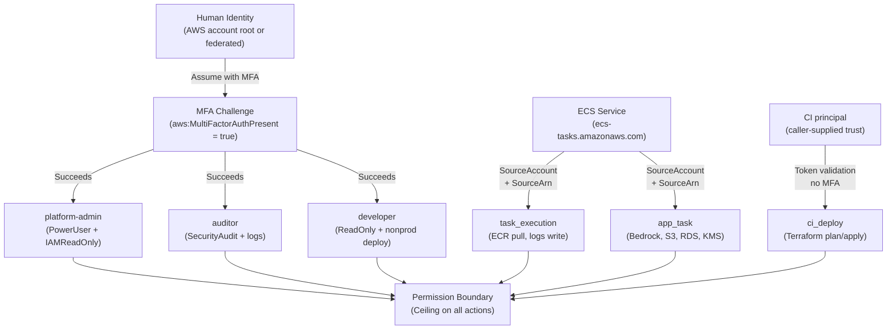

# RBAC Model — Federal LLM Blueprint

## Principals Inventory

### Service Roles
All service roles are assumed by AWS services (not humans) and have permission boundaries attached. No service role assumes any other role.

| Role | Trust Principal | Boundary | Purpose |
|------|-----------------|----------|---------|
| `task_execution` | ECS service (`ecs-tasks.amazonaws.com`) with SourceAccount condition | Yes | ECR image pull, CloudWatch Logs write, Secrets Manager read (for task secrets) |
| `app_task` | ECS service (`ecs-tasks.amazonaws.com`) with SourceAccount condition | Yes | Application runtime: Bedrock invoke (named models), S3 read (named prefixes), RDS database connect (named users), KMS decrypt (via ViaService conditions) |
| `ci_deploy` | Caller-supplied AWS principals (CI roles/users); created only when trust principals are supplied. GitHub OIDC federation requires a consumer-supplied Federated trust document. | Yes | Terraform plan (AWS managed ReadOnlyAccess). Apply permissions are deliberately not shipped — consumers grant them per environment; the boundary still caps whatever they grant. |

### Human Role Tiers
All human roles require MFA on assumption (enforced via IAM condition `aws:MultiFactorAuthPresent = true`). All have permission boundaries attached.

| Tier | Trust | Boundary | Policies | Use Case |
|------|-------|----------|----------|----------|
| `platform-admin` | Explicit account principals + MFA condition | Yes | PowerUser + IAMReadOnly (capped by boundary; read-only on account structure, no create/delete of roles) | Operational administration: service restarts, scaling, diagnostics. Infrastructure changes flow through Terraform/CI, not this role. |
| `auditor` | Explicit account principals + MFA condition | Yes | SecurityAudit + CloudTrail read + CloudWatch Logs read + S3 read (audit buckets only) | Compliance monitoring, log review |
| `developer` | Explicit account principals + MFA condition | Yes | ReadOnlyAccess + scoped ECS deploy (ecs:UpdateService/UpdateTaskSet conditioned on Environment tag dev/staging) | Debugging and nonprod deploys |

### Permission Boundary
A single boundary policy is created in the `iam` module and attached to every created role (service and human). The boundary is the ceiling of allowed actions across all principals.

**Boundary Denies (explicit negations):**
- `iam:PutRolePermissionsBoundary`, `iam:DeleteRolePermissionsBoundary` — prevent boundary stripping
- `iam:CreateRole`, `iam:AttachRolePolicy`, `iam:PutRolePolicy` — denied *unless* the target role carries this same boundary (`iam:PermissionsBoundary` condition): bounded principals can only ever mint equally-bounded roles
- `iam:CreateAccessKey`, `iam:CreateLoginProfile` — prevent direct credential creation (use STS assume-role)
- `organizations:*` — prevent lateral movement to other accounts
- `iam:DeleteUser`, `iam:DeleteRole`, `kms:ScheduleKeyDeletion`, `kms:PutKeyPolicy` — prevent key/identity deletion
- `cloudtrail:StopLogging`, `config:StopConfigurationRecorder`, `config:DeleteConfigurationRecorder` — prevent audit trail tampering
- `sts:AssumeRoleWithSAML`, `sts:AssumeRoleWithWebIdentity` — restrict to `sts:AssumeRole` and named federation paths only

**Boundary Allows (ceiling of services):**
All services except those listed above, with explicit resource scoping enforced per role (defined in role policies, not the boundary).

---

## The RBAC Matrix

This table maps every principal × action class to resource scope, conditions, and 800-53 controls. "Boundary-capped" is always "yes" (the boundary is universal). Resource scopes use ARN placeholders; Terraform variables and outputs populate specific values.

| Principal | Action Class | Resource Scope | Conditions | 800-53 Control |
|-----------|--------------|-----------------|------------|-----------------|
| `task_execution` | ECR image pull | `arn:aws:ecr:{region}:{account}:repository/{project}-llm-gateway` | SourceAccount, SourceArn (ECS task) | SI-4 (Container image validation) |
| `task_execution` | CloudWatch Logs write | `arn:aws:logs:{region}:{account}:log-group:/ecs/{project}-llm-gateway:*` | None | AU-4 (Audit storage) |
| `task_execution` | Secrets Manager read | `arn:aws:secretsmanager:{region}:{account}:secret:{project}-*` | Resource policy restricts to app_task role | IA-5 (Secret retrieval) |
| `app_task` | Bedrock invoke (named models) | `arn:aws:bedrock:{region}::model/anthropic.claude-3-opus-*` (specified in var.bedrock_model_arns) | None | AC-3 (Model access control) |
| `app_task` | S3 read (documents) | `arn:aws:s3:::{project}-documents/{prefix}*` (specified in var.documents_prefix) | s3:x-amz-server-side-encryption = aws:kms (enforced by bucket policy) | AC-3 (Document read scoping) |
| `app_task` | RDS database connect | `arn:aws:rds-db:{region}:{account}:dbuser:{db-resource-id}/{db_username}` (variable per environment) | RDS resource policy restricts to iam-auth users | AC-3 + IA-5 (Database auth) |
| `app_task` | KMS decrypt (data key) | `arn:aws:kms:{region}:{account}:key/{data-key-id}` | `kms:ViaService` = s3.{region}.amazonaws.com OR rds.{region}.amazonaws.com (scoped by service) | SC-12 (Encryption key access) |
| `app_task` | KMS decrypt (secrets key) | `arn:aws:kms:{region}:{account}:key/{secrets-key-id}` | `kms:ViaService` = secretsmanager.{region}.amazonaws.com | SC-12 (Secrets decryption) |
| `ci_deploy` | Terraform plan | All resources (ReadOnlyAccess) | Caller-supplied trust principals (no MFA: CI is non-interactive) | AC-2 (CI principal identity) |
| `ci_deploy` | Create/update resources | Scoped to module namespaces (e.g., `{project}-*` resources) | None | AC-3 (Scoped deployment) |
| `platform-admin` | Infrastructure read/write | All resources except deletion/stripping operations | MFA required (aws:MultiFactorAuthPresent = true) | AC-2 + AC-3 (Admin ops) |
| `platform-admin` | IAM read-only | IAM resources, roles, policies | MFA required | AC-2 + AU-1 (Audit readiness) |
| `auditor` | CloudTrail read | `arn:aws:cloudtrail:{region}:{account}:trail/{project}-audit` | None | AU-1 (Audit access) |
| `auditor` | CloudWatch Logs read | All log groups in `/ecs/*`, `/rds/*`, `/kms/*` namespaces | None | AU-1 (Observability) |
| `auditor` | S3 read (audit buckets) | `arn:aws:s3:::{project}-audit-*/{prefix}*` (audit and trail buckets) | None | AU-4 (Audit data access) |
| `developer` | ECR push (nonprod) | `arn:aws:ecr:{region}:{account}:repository/{project}-dev-*` (dev/staging only) | None | AC-3 (Image build) |
| `developer` | ECS deploy (nonprod) | `ecs:UpdateService` on services matching `{project}-dev-*` or `{project}-staging-*` | None | AC-3 (Scoped deploy) |

---

## Role Assumption Paths

**Human Assumption:**
- Principal: any AWS account principal (e.g., `arn:aws:iam::{account}:user/alice`) or federated identity
- Condition: `aws:MultiFactorAuthPresent = true` (enforced on role trust policy)
- Assumption: `sts:AssumeRole` to role ARN
- Each tier (admin, auditor, developer) is a separate role; assumption to multiple roles is permitted

**ECS Service Assumption:**
- Principal: `ecs-tasks.amazonaws.com` (AWS service principal)
- Conditions: `aws:SourceAccount = {account}`, `aws:SourceArn = {ecs-cluster-arn}` (prevent cross-account/cluster hijacking)
- Assumption: automatic at task launch; task spec references role ARN in `executionRoleArn` and `taskRoleArn`
- Two roles: task_execution (for ECS agent operations), app_task (for application operations)

**CI Assumption:**
- Principal: GitHub Actions OIDC provider (external ID = repository owner/name)
- Condition: GitHub token validation (no MFA: non-interactive, rate-limited by GitHub action secrets)
- Assumption: once at workflow start; `aws-actions/configure-aws-credentials` action performs assume-role
- Created only when GitHub Actions principal is supplied to the `iam` module

---

## Escalation Analysis

Three classic privilege-escalation paths are explicitly blocked by the boundary deny list:

### Path 1: Create Unbounded Role
**Attack:** Principal with `iam:CreateRole` and `iam:AttachRolePolicy` creates a role with no boundary, then assumes it.

**Mitigation:** Boundary deny on `iam:CreateRole` and `iam:PutRolePermissionsBoundary`.
- Line in boundary: `"Action": ["iam:CreateRole"] with condition "StringNotEquals": {"iam:PermissionsBoundary": boundary_arn}` → DENY
- Even if a principal has `iam:CreateRole` in their identity policy, the boundary blocks creation unless the request includes the boundary ARN. Since the boundary policy denies modifying itself, the boundary cannot be stripped post-creation.

### Path 2: Strip Own Boundary
**Attack:** Principal modifies their own role to remove the boundary, then attaches unbounded policies.

**Mitigation:** Boundary deny on `iam:PutRolePermissionsBoundary` and `iam:DeleteRolePermissionsBoundary`.
- Line in boundary: `"Action": ["iam:PutRolePermissionsBoundary", "iam:DeleteRolePermissionsBoundary"]` → explicit DENY
- No condition needed; the action is always denied.

### Path 3: Delete Key or Disable Audit
**Attack:** Principal deletes a KMS key or stops CloudTrail to eliminate evidence.

**Mitigation:** Boundary deny on `kms:ScheduleKeyDeletion`, `kms:PutKeyPolicy`, `cloudtrail:StopLogging`, `config:StopConfigurationRecorder`.
- Lines in boundary:
  - `"Action": ["kms:ScheduleKeyDeletion", "kms:PutKeyPolicy"]` → explicit DENY
  - `"Action": ["cloudtrail:StopLogging", "config:StopConfigurationRecorder", "config:DeleteConfigurationRecorder"]` → explicit DENY
- These actions are denied to all roles, including platform-admin (who can use AWS support or principal-account console to manage keys/trails).

**Why the boundary is superior to role policies:**
The boundary applies to *all* roles. An identity policy can be edited by an IAM admin; a boundary cannot be changed by code in this repository (it is version-controlled and reviewed). The boundary is the enforcement point, not a suggestion.

---

## Forward Mapping to NIST 800-53 Rev5

These three controls are the primary audience for the RBAC model:

- **AC-2 (Access Control - Account Management):** The principals inventory defines the access-control accounts (roles) that exist. CONTROLS.md will cite this section.
- **AC-3 (Access Control - Enforcement):** The matrix defines enforcement points — which resources are scoped to which principals, and via which conditions. Week-7 control mapping will cite specific rows.
- **AC-6 (Access Control - Least Privilege):** The permission boundary and per-role resource scoping enforce least-privilege design. Escalation analysis demonstrates preventive controls.

Week-7's `CONTROLS.md` will include a reference section pointing here for AC-2/AC-3/AC-6 evidence.
