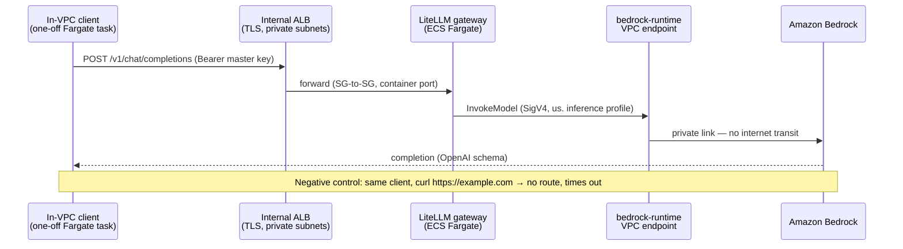

# Full-Stack Proof — Verification Procedure

## Status

- **Static proof:** Automated in CI — `terraform validate`/`test` across all eight modules, plus the composition validated in `examples/full-stack`.
- **Dynamic proof:** EXECUTED 2026-07-09 against a live sandbox deployment of `examples/full-stack` (commercial us-east-1, demo profile, account id scrubbed to `123456789012`). Transcripts below are from that run.

## Claim

One `terraform apply` of `examples/full-stack` produces a working stack in which:

1. All eight modules deploy together — network, kms, iam, gateway, vector store, document store, audit, observability (147 resources).
2. The LiteLLM gateway answers an OpenAI-compatible completion request **from inside the VPC**, served by Bedrock through the `bedrock-runtime` interface endpoint.
3. The no-egress invariant holds with the workload present: the same in-VPC client that reaches the gateway cannot reach the public internet.
4. The vector plane works end to end: pgvector extension, HNSW index, similarity search — proven by the in-VPC seed task.
5. The audit plane observes it all: the completion request is visible in the gateway logs, the Bedrock invocation log, and CloudTrail.

## Request Path



## Environment

| | |
|---|---|
| Composition | `examples/full-stack`, demo profile (`terraform.tfvars.example` shape) |
| Region / account | us-east-1 / `123456789012` (scrubbed) |
| Model | `anthropic.claude-sonnet-4-5-20250929-v1:0` via `us.` inference profile |
| Images | LiteLLM `main-stable`, `curlimages/curl`, seed image per `scripts/README.md` — all mirrored to private ECR, digest-pinned |

## Findings Fixed During This Run

Nine defects surfaced only under live execution — all fixed at the source (modules, scripts), not worked around. None were catchable by `terraform validate`, mocked tests, tflint, or checkov; this is why the proof exists.

1. **Missing `ssm` interface endpoint.** The gateway task's config is injected via ECS secrets from an SSM parameter (ADR-005); without a `com.amazonaws.<region>.ssm` endpoint the Fargate agent cannot fetch it in a no-egress VPC and every task fails with `ResourceInitializationError`. The endpoint is now part of the network module's default map.
2. **S3 endpoint policy blocked ECR layer pulls.** The restrictive `aws:ResourceAccount` condition on the S3 gateway endpoint cannot match the AWS-owned regional ECR layer bucket (`prod-<region>-starport-layer-bucket`), so every image pull failed with `CannotPullContainerError`. The policy now carries a read-only exception for that bucket, per the AWS ECR VPC-endpoint documentation.
3. **No app-tier path to the gateway.** The app security group's egress allowed only VPC endpoints, the S3 prefix list, and the vector store — no rule reached the ALB, so no in-VPC workload could ever call the gateway it exists to serve. The gateway module (which owns the ALB SG) now adds an app-SG → ALB-SG egress rule on 443, with a matching test assertion.
4. **`runbook_url` fragment broke every observability alarm.** CloudWatch tag values allow only letters, numbers, spaces, and `_ . : / = + - @`; the examples passed a RunbookUrl ending in `#runbooks` and every `PutMetricAlarm` failed. The observability module now rejects invalid URLs at plan time (variable validation + test); the examples dropped the fragment.
5. **Config-rule control tags rejected.** `PutConfigRule` enforces the same tag charset — the `Nist80053Controls` tag joined control ids with commas and kept `SC-8(1)`-style parentheses, so 7 of 10 rules failed. The tag is now space-separated with dotted OSCAL-form enhancement ids (`SC-8 SC-8.1`).
6. **Hardened task could not boot on Fargate.** The trio of read-only root FS + non-root user + config materialized to a volume-mounted `/tmp` fails at runtime: Fargate bind mounts surface root-owned `0755`, so UID 1000 gets `Permission denied` writing its config. A non-essential `tmp-init` container (same image, root, `chmod 1777 /tmp`) now runs first and the gateway `dependsOn` its `SUCCESS` — the AWS-documented pattern, with hardening assertions extended to cover it.
7. **Seed script used the wrong boto3 kwarg.** `generate_db_auth_token()` takes `DBUsername`, not `DBUser`; the in-VPC seed task died on a `TypeError` before touching the database.
8. **Log-delivery buckets could never destroy.** CloudTrail and the ALB deliver objects continuously, so `terraform destroy` reliably fails on the versioned `audit-logs`/`alb-logs` buckets with `BucketNotEmpty`. The document-store and audit modules now expose `force_destroy` (default **false** — production posture unchanged), and the examples surface it as the `force_destroy_buckets` teardown aid.
9. **The teardown sweeper could miss residue.** `aws --output text` prints scalar-list query results tab-separated on one line, so the sweeper's per-item loops only ever examined the first item — it reported a clean sweep while two buckets survived. Every single-column pipeline now splits tabs to newlines, with a regression test whose matching resource is deliberately mid-line.

## Transcripts

All transcripts below are from the 2026-07-09 run, edited only to scrub the account id, generated hostname fragments, and unrelated account traffic.

### 1. Apply

```text
Plan: 147 to add, 0 to change, 0 to destroy.
...
Apply complete! Resources: 147 added, 0 changed, 0 destroyed.
```

(The apply that produced the healthy stack includes the six findings' fixes above; the initial attempt surfaced them exactly as described.)

### 2. Gateway — positive and negative controls (in-VPC client)

One-off Fargate task (mirrored `curlimages/curl`, app SG, private subnet, no public IP) runs both controls; output read back from the gateway log group:

```text
20:37:28 === POSITIVE CONTROL ===
20:37:32 {"id":"chatcmpl-08700e07-20e6-46b3-a402-27ffb026263c","created":1783629452,
  "model":"claude-sonnet-4-5","object":"chat.completion","choices":[{"finish_reason":"length",
  "index":0,"message":{"content":"Hello from inside the VPC! 👋\n\nI'm running in a private
  network environment with controlled access and security boundaries. [...]","role":"assistant"}}],
  "usage":{"completion_tokens":100,"prompt_tokens":15,"total_tokens":115}}
20:37:32 === NEGATIVE CONTROL ===
20:37:42 EGRESS BLOCKED (expected)
```

The negative control (`curl -s --max-time 10 https://example.com`) timed out: no route to the internet exists, so the week-2 no-egress invariant holds with the workload live. A second no-egress artifact appeared unprompted in the gateway's own startup log:

```text
20:35:34 LiteLLM:WARNING: Failed to fetch remote model cost map from
  https://raw.githubusercontent.com/... : [Errno 101] Network is unreachable.
  Falling back to local backup.
```

### 3. Vector plane — bootstrap + seed tasks

Bootstrap (mirrored `postgres:16-alpine`, master credentials from the RDS-managed secret, `modules/vector-store/bootstrap.sql`):

```text
20:38:47 CREATE EXTENSION
20:38:47 CREATE ROLE
20:38:47 GRANT ROLE
20:38:47 GRANT
20:38:47 GRANT
```

Seed (image per `scripts/README.md`, `app_user` via IAM auth token, `sslmode=verify-full`):

```text
20:42:11 [seed] Connecting to fedllm-prod-vector.cXXXXXXXXXXX.us-east-1.rds.amazonaws.com:5432/vectordb (auth=iam)
20:42:11 [seed] Connection established
20:42:11 [seed] Creating embeddings table (idempotent)
20:42:11 [seed] Creating HNSW index for cosine distance (idempotent)
20:42:11 [seed] Inserting 8 sample vectors (8-dimensional proof-of-concept)
20:42:11 [seed] Querying 3 nearest neighbors to probe vector
20:42:11   [seed]   id=1, doc_id=doc_1, chunk=chunk_1, distance=0.000000
20:42:11   [seed]   id=7, doc_id=doc_4, chunk=chunk_1, distance=0.614780
20:42:11   [seed]   id=6, doc_id=doc_3, chunk=chunk_2, distance=0.924470
20:42:11 [seed] ✓ Nearest neighbor assertion passed (id=1 is closest)
20:42:11 [seed] SUCCESS: pgvector bootstrap complete
```

### 4. Audit plane — the same request, three ways

The 20:37 completion request from transcript 2, correlated across planes (see `docs/audit-correlation.md` for the seams):

Gateway container log (request plane):

```text
20:37:32 INFO: 10.0.39.22:10178 - "POST /v1/chat/completions HTTP/1.1" 200 OK
```

Bedrock model-invocation log (model plane — metadata only per ADR-007; token counts match the response's usage block exactly, no prompt content recorded):

```text
20:37:29 {"timestamp":"2026-07-09T20:37:29Z","accountId":"123456789012","region":"us-east-1",
  "requestId":"116544f5-4c39-46ab-b842-d24111936ff7","operation":"Converse",
  "modelId":"us.anthropic.claude-sonnet-4-5-20250929-v1:0",
  "input":{"inputContentType":"application/json","inputTokenCount":15},
  "output":{"outputContentType":"application/json","outputTokenCount":100}, ...}
```

ALB access logs delivering to the document-store bucket (network plane):

```text
2026-07-09 16:40:08  464  alb/AWSLogs/123456789012/elasticloadbalancing/us-east-1/2026/07/09/
  123456789012_elasticloadbalancing_us-east-1_app.fedllm-prod-gateway.XXXXXXXXXXXXXXXX_20260709T2040Z_10.0.39.22_XXXXXXXX.log.gz
```

CloudTrail (control plane — the out-of-band master-key population is attributable):

```text
2026-07-09T16:13:33-04:00  PutSecretValue  Eric
```

### 5. Teardown

Deletion protections off, `force_destroy_buckets = true`, then destroy and sweep:

```text
Destroy complete!

$ scripts/verify-teardown.sh -p fedllm -e prod -r us-east-1
INFO secrets-manager fedllm-prod-gateway-master-key scheduled-deletion-on-2026-07-09T16:53:25
SUMMARY residue=0 info=1
```

The RDS final snapshot and the retained automated backup were deleted explicitly after the sweep flagged them (both billable). The remaining INFO is the master-key secret inside its free scheduled-deletion window. The private ECR mirror repositories (litellm, curl, postgres, seed-vectors; ~3 GB total, ≈$0.30/month) live outside the composition and were deliberately kept for redeployment.

## Residual Gaps

- The per-module proof procedures (`no-egress-proof.md`, `gateway-proof.md`, `vector-proof.md`, `audit-walkthrough.md`) are written against `examples/minimal` and still carry TRANSCRIPT PENDING markers — this full-stack run proves the same claims one layer up, but executing each documented procedure verbatim remains open work (good first issues).
- The RAG workload integration (agentic-rag container answering cited questions over the documents bucket) lands post-v0.1.0; the gateway-as-workload fallback above is the documented v0.1.0 scope.
